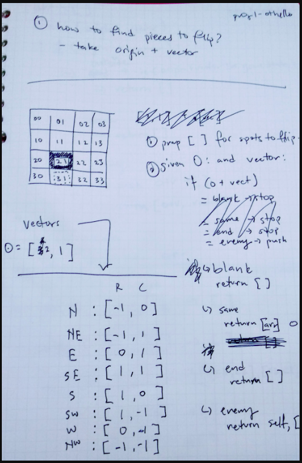
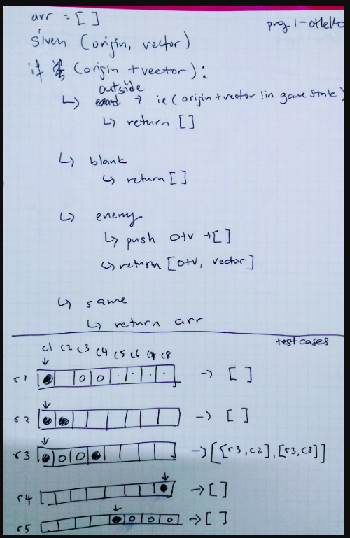
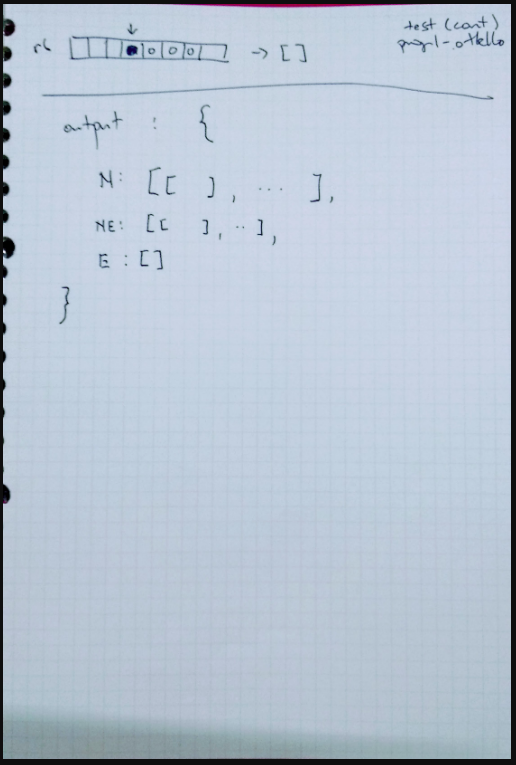

## Project Post Mortem
Post mortems are important to understand about what happened in a project and actively think about what you learned.

Post-mortems are meant to be a blame-less space open to objective conversation about what went well and what could be improved.

Even in the examples below, where tens of millions of dollars could be lost, the best approach is to think through the series of events that led to the outcome.

Large mistakes are almost never the fault of the developer, but of the sytems and processes in place to prevent errors and problems.

[https://github.com/danluu/post-mortems](https://github.com/danluu/post-mortems)

[https://blog.codinghorror.com/the-project-postmortem/](https://blog.codinghorror.com/the-project-postmortem/)

### What to Bring
Please answer the following questions. Take at least 30 minutes to prepare.

#### Approach and Process

1. What in my process and approach to this project would I do differently next time?

    _I'd want to make more atomic commits by setting clearer micro goals; I find that when I get into a flow state I tend to branch out beyond what I know I wanted to do immediately and forget to commit once it works and start working on something else, which then makes changes to the previous change, which is then hard to unpick and make into small commits._

1. What in my process and approach to this project went well that I would repeat next time?

    _I'm glad I wrote small chunks of my documentation as I went along, because that really helped me not have to describe my entire project in one sitting, and also reminded me what I'd done previously._

---

#### Code and Code Design

1. What in my code and program design in the project would I do differently next time?

    _I'd like to move away from using setTimeout(). Using Promises in the two functions below might allow for a user's chain of flips to complete before the next move could be made._

        let flipSquares = function (sqArr) {
          let pcArr = [];
          for (let sq = 0; sq < sqArr.length; sq++) {
            let square = gameState[sqArr[sq][0]][sqArr[sq][1]];
            square.dataset.colour = currentPlayer.colour;
            pcArr.push(square.firstChild);
          }
          for (let i = 0; i < pcArr.length; i++) {
            setTimeout(flipPiece, i * 300, pcArr[i]);
          }
        };

        let flipSquares = function (sqArr) {
          let pcArr = [];
          for (let sq = 0; sq < sqArr.length; sq++) {
            let square = gameState[sqArr[sq][0]][sqArr[sq][1]];
            square.dataset.colour = currentPlayer.colour;
            pcArr.push(square.firstChild);
          }
          for (let i = 0; i < pcArr.length; i++) {
            setTimeout(flipPiece, i * 300, pcArr[i]);
          }
        };

1. What in my code and program design in the project went well? Is there anything I would do the same next time?

    _I found it really helpful to doodle out the algorithm for returning matches when trying to think about it instead of solving it in code directly. The time I spent actually implementing this became only about 15 minutes; I spent probably about an hour on paper, but I'm not sure that I would have arrived at the same function if I'd spend 1h15mins on it in code._

    
    
    

---

#### WDI Unit 1 Post Mortem
1. What habits did I use during this unit that helped me?

    _It was helpful to use function signatures to describe what my code would eventually do, before actually writing much internal logic._

2. What habits did I have during this unit that I can improve on?

    _I have a habit of having an idea pop up about another function while working on something and jumping to it quickly so I don't lose the idea. I should try to scribble those down quickly and finish up the current unit of work instead so I don't end up with the abovementioned tangled commits._

3. How is the overall level of the course during this unit? (instruction, course materials, etc.)

    _I think it worked okay for me; pairing is stil a difficult thing to do because I sometimes feel like I need the time to work through an exercise on my own for the mechanics of whatever I'm doing to sink in, then experiment with tweaking bits of it to see how parts of the code interact. This can make it feel when I'm pairing that I'm working through something, but it's not really sinking in._